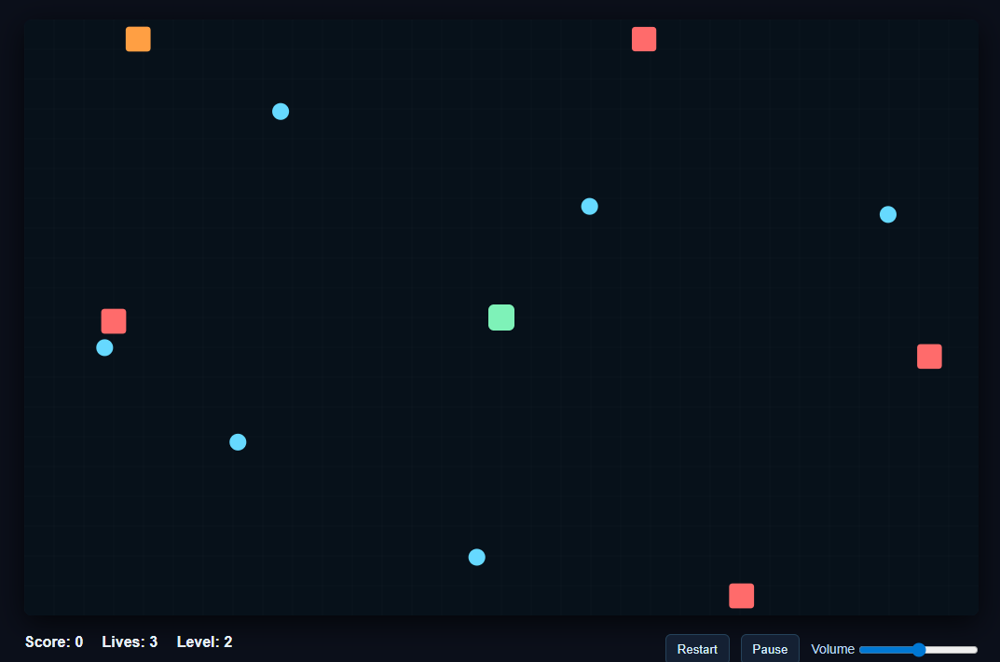

# Multi-Language Web Game

A lightweight browser-based game using **HTML, CSS, JavaScript** for the frontend, with **Python and C/C++** handling optimizations and backend computations. Runs locally in the browser when opening `index.html`.

## ScreenShot

## Features

- Frontend: Interactive gameplay via HTML5 canvas and JavaScript
- Styling: Customizable visual themes with CSS
- Backend/Optimizations: Python and C/C++ code improve performance and handle heavy calculations
- Lightweight: No extra libraries required; runs directly in a modern browser
- Cross-platform: Works on Windows, macOS, and Linux

## How to Run

1. Ensure all files are in the same folder:
   - `index.html`
   - `main.js`
   - `styles.css`
   - `helper.c`
   - `python_pygame.py`
   - `cplusplus.cpp`
2. Double-click `index.html` to open the game in your default browser.

## Project Structure

- `index.html` - Main HTML file for game interface  
- `styles.css` - Styling and UI design  
- `main.js` - Core frontend game logic  
- `helper.c` - C code for optimizations  
- `cplusplus.cpp` - Performance-critical logic written in C++  
- `python_pygame.py` - Optional Python module for extra game features  

## Notes

- Game is optimized to run smoothly in modern browsers using minimal resources.
- C++ and Python modules are called for heavy computations, ensuring high FPS and smooth gameplay.
- No additional installation required - just a browser that supports HTML5 and JavaScript.

## Future Improvements

- Add multiplayer support
- Enhance AI with Python/C++ modules
- Add sound effects and animations
- Track player scores and achievements